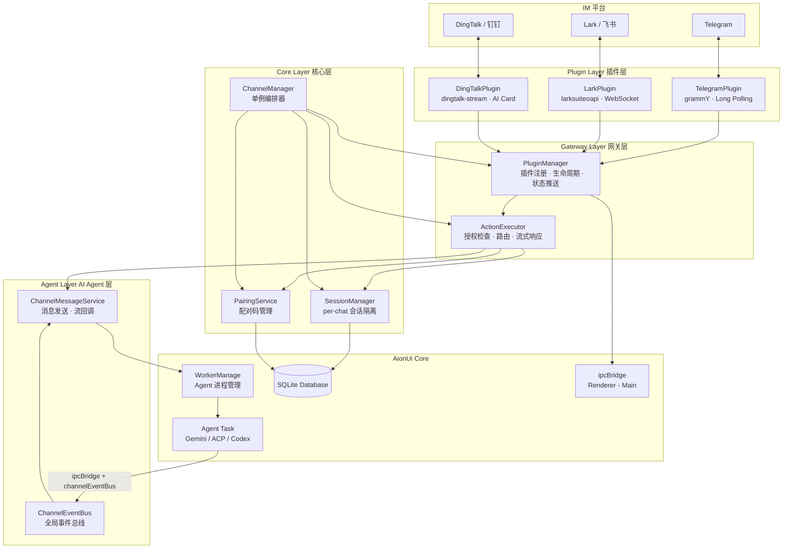
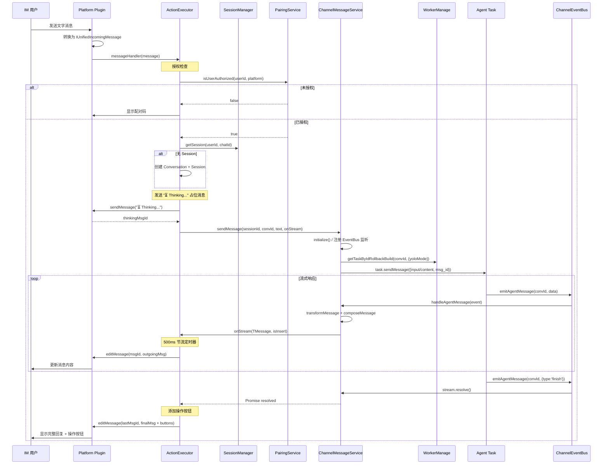

# Channels 架构分析

## 1. 概述

Channels 是 AionUi 的多平台 AI 助手框架，将 AionUi 的 AI 能力（Gemini、Claude、Codex）通过即时通讯平台暴露给远程用户。目前支持三个平台：

| 平台                 | SDK                     | 连接方式              | 消息更新                        |
| -------------------- | ----------------------- | --------------------- | ------------------------------- |
| **Telegram**         | grammY                  | 长轮询 (Long Polling) | 编辑消息文本                    |
| **Lark（飞书）**     | @larksuiteoapi/node-sdk | WebSocket 长连接      | 编辑互动卡片 (Interactive Card) |
| **DingTalk（钉钉）** | dingtalk-stream         | WebSocket Stream      | AI Card 流式更新                |

核心设计原则：**平台无关的统一消息协议** — 所有平台插件将原生消息转换为 `IUnifiedIncomingMessage`，所有回复通过 `IUnifiedOutgoingMessage` 发出，由各平台适配器转回原生格式。

---

## 2. 目录结构

```
src/channels/
├── index.ts                          # 模块导出入口
├── types.ts                          # 全局类型定义与转换工具函数
├── ARCHITECTURE.md                   # 本文档
│
├── core/                             # 核心编排层
│   ├── ChannelManager.ts             # 单例编排器，管理子系统生命周期
│   └── SessionManager.ts             # 用户会话管理（per-chat 隔离）
│
├── gateway/                          # 网关层：消息路由与插件管理
│   ├── ActionExecutor.ts             # 消息路由 → Action 执行 → AI 对话
│   ├── PluginManager.ts              # 插件注册、生命周期、状态推送
│   └── index.ts
│
├── agent/                            # AI Agent 集成层
│   ├── ChannelEventBus.ts            # 全局事件总线（Agent → Channel）
│   ├── ChannelMessageService.ts      # 消息发送与流回调管理
│   └── index.ts
│
├── actions/                          # Action 处理器（命令/按钮响应）
│   ├── types.ts                      # Action 类型定义与常量
│   ├── SystemActions.ts              # 会话管理、帮助、设置、Agent 切换
│   ├── PlatformActions.ts            # 配对流程（pairing.show/refresh/check）
│   ├── ChatActions.ts                # 对话操作（发送、重新生成、工具确认）
│   └── index.ts
│
├── pairing/                          # 用户授权配对子系统
│   ├── PairingService.ts             # 配对码生成、审批、过期清理
│   └── index.ts
│
├── plugins/                          # 平台插件实现
│   ├── BasePlugin.ts                 # 抽象基类，定义生命周期状态机
│   ├── index.ts
│   │
│   ├── telegram/                     # Telegram 插件
│   │   ├── TelegramPlugin.ts         # Bot 实例管理、长轮询、消息分发
│   │   ├── TelegramAdapter.ts        # 消息格式转换（Telegram ↔ Unified）
│   │   ├── TelegramKeyboards.ts      # Inline Keyboard 与 Reply Keyboard 构建
│   │   └── index.ts
│   │
│   ├── lark/                         # Lark（飞书）插件
│   │   ├── LarkPlugin.ts             # WebSocket 连接、事件去重、卡片消息
│   │   ├── LarkAdapter.ts            # 消息格式转换（Lark ↔ Unified）
│   │   ├── LarkCards.ts              # 互动卡片模板（菜单、帮助、配对等）
│   │   └── index.ts
│   │
│   └── dingtalk/                     # DingTalk（钉钉）插件
│       ├── DingTalkPlugin.ts         # Stream 连接、AI Card 流式、Token 管理
│       ├── DingTalkAdapter.ts        # 消息格式转换（DingTalk ↔ Unified）
│       ├── DingTalkCards.ts          # AI Card / ActionCard 模板
│       ├── README.md                 # DingTalk 插件说明
│       └── index.ts
│
└── utils/                            # 工具函数
    ├── credentialCrypto.ts           # 凭据 Base64 编解码
    └── index.ts
```

---

## 3. 整体架构

### 3.1 分层架构图



### 3.2 ChannelManager 编排关系

`ChannelManager` 是整个 Channel 子系统的单例入口，在应用启动时调用 `initialize()`，关闭时调用 `shutdown()`。它创建并持有以下四个核心子组件：

```
ChannelManager (singleton)
├── PluginManager         -- 插件注册/启停/状态监控
├── SessionManager        -- 用户会话内存缓存 + DB 持久化
├── PairingService        -- 配对码生成/审批/定时清理
└── ActionExecutor        -- 消息路由/Action 分发/AI 对话
```

初始化时的关键连线：

1. `ActionExecutor` 注入 `PluginManager`、`SessionManager`、`PairingService`
2. `PluginManager.setMessageHandler()` 设置为 `ActionExecutor.getMessageHandler()`
3. `PluginManager.setConfirmHandler()` 设置为工具确认回调（经由 `ChannelMessageService.confirm()`）
4. 从数据库加载已启用的插件并逐个启动

---

## 4. 核心类型定义

### 4.1 Plugin 相关

```typescript
type PluginType = 'telegram' | 'slack' | 'discord' | 'lark' | 'dingtalk';
type PluginStatus = 'created' | 'initializing' | 'ready' | 'starting' | 'running' | 'stopping' | 'stopped' | 'error';

interface IChannelPluginConfig {
  id: string;
  type: PluginType;
  name: string;
  enabled: boolean;
  credentials?: IPluginCredentials; // 加密存储（Base64）
  config?: IPluginConfigOptions; // mode, webhookUrl, rateLimit, requireMention
  status: PluginStatus;
  lastConnected?: number;
  createdAt: number;
  updatedAt: number;
}
```

### 4.2 统一消息协议

```typescript
// 入站（平台 → 系统）
interface IUnifiedIncomingMessage {
  id: string;
  platform: PluginType;
  chatId: string;
  user: IUnifiedUser;
  content: IUnifiedMessageContent;
  timestamp: number;
  action?: IMessageAction;
  raw?: unknown;
}

// 出站（系统 → 平台）
interface IUnifiedOutgoingMessage {
  type: 'text' | 'image' | 'file' | 'buttons';
  text?: string;
  parseMode?: 'HTML' | 'MarkdownV2' | 'Markdown';
  buttons?: IActionButton[][];
  replyMarkup?: unknown;
  // ...
}
```

### 4.3 Action 体系

```typescript
type ActionCategory = 'platform' | 'system' | 'chat';

interface IRegisteredAction {
  name: string; // e.g. 'session.new', 'pairing.show'
  category: ActionCategory;
  description: string;
  handler: ActionHandler; // (context, params?) => Promise<IActionResult>
}
```

### 4.4 Session 与 Agent

```typescript
type ChannelAgentType = 'gemini' | 'acp' | 'codex';

interface IChannelSession {
  id: string;
  userId: string;
  agentType: ChannelAgentType;
  conversationId?: string;
  workspace?: string;
  chatId?: string; // per-chat 隔离键（如 "user:xxx" 或 "group:xxx"）
  createdAt: number;
  lastActivity: number;
}
```

---

## 5. 消息/事件流转

### 5.1 主消息流（用户发文字 → AI 回复）



### 5.2 流式响应节流机制

`ActionExecutor.handleChatMessage()` 中实现了基于定时器的节流控制，核心参数：

- **UPDATE_THROTTLE_MS = 500ms** — 最小更新间隔
- **pendingMessage** — 缓冲区，保存最新待发送消息
- **pendingUpdateTimer** — 延迟定时器，确保最后一条消息一定被发送

逻辑：

1. 收到流式消息时，若距上次发送 ≥ 500ms → 立即发送
2. 若在 500ms 窗口内 → 设定延迟定时器（delay = 500ms - 已过时间）
3. 新消息覆盖 `pendingMessage`，重置定时器
4. 流结束时：清理定时器 → 发送剩余消息 → 编辑最后一条消息添加操作按钮

首条流式消息的特殊处理：始终作为对 "⏳ Thinking..." 消息的编辑（而非插入新消息），避免异步竞态条件。

### 5.3 Action 系统

三类 Action 及其处理器：

| 类别         | 名称                              | 处理器                 | 说明                                  |
| ------------ | --------------------------------- | ---------------------- | ------------------------------------- |
| **system**   | `session.new`                     | `handleSessionNew`     | 创建新会话（清理旧 Session + Worker） |
|              | `session.status`                  | `handleSessionStatus`  | 显示当前会话状态                      |
|              | `help.show/features/pairing/tips` | `handleHelp*`          | 帮助信息                              |
|              | `settings.show`                   | `handleSettingsShow`   | 设置引导                              |
|              | `agent.show`                      | `handleAgentShow`      | 显示可用 Agent 列表                   |
|              | `agent.select`                    | `handleAgentSelect`    | 切换 Agent 类型                       |
| **platform** | `pairing.show`                    | `handlePairingShow`    | 生成并显示配对码                      |
|              | `pairing.refresh`                 | `handlePairingRefresh` | 刷新配对码                            |
|              | `pairing.check`                   | `handlePairingCheck`   | 检查配对状态                          |
|              | `pairing.help`                    | `handlePairingHelp`    | 配对帮助                              |
| **chat**     | `chat.send`                       | `handleChatSend`       | 占位（实际由 ActionExecutor 处理）    |
|              | `chat.regenerate`                 | `handleChatRegenerate` | 重新生成回复                          |
|              | `chat.continue`                   | `handleChatContinue`   | 继续生成                              |
|              | `action.copy`                     | `handleCopy`           | 复制提示                              |
|              | `system.confirm`                  | `handleToolConfirm`    | 工具确认                              |

### 5.4 工具确认（Tool Confirmation）流程

```
Agent 请求确认 → Agent Task 广播 tool_group (status=Confirming)
    → ChannelEventBus → ChannelMessageService → ActionExecutor
    → 根据平台构建确认 UI（Telegram: InlineKeyboard / Lark: 互动卡片 / DingTalk: AI Card 按钮）
    → Plugin 推送给用户

用户点击按钮 → Plugin 解析回调数据
    → Telegram: confirmHandler(userId, 'telegram', callId, value)
    → Lark: extractCardAction → messageHandler → handleToolConfirm
    → DingTalk: extractCardAction → confirmHandler(userId, 'dingtalk', callId, value)
    → ChannelMessageService.confirm(conversationId, callId, value)
    → Agent Task.confirm() → Agent 继续执行
```

### 5.5 Agent 双路广播

Agent Task（如 GeminiAgentManager）发送消息时同时通过两条路径：

1. **ipcBridge** → Renderer 进程（更新 AionUi 桌面界面）
2. **channelEventBus** → ChannelMessageService（更新 IM 平台消息）

这两条路径互不干扰，实现了 AionUi 桌面端和 IM 端的同步显示。

---

## 6. 配置信息读写与存储

### 6.1 Plugin 配置与凭据加密

Plugin 配置存储在 `assistant_plugins` 表中，`config` 列以 JSON 格式存储 `{ credentials, config }`。

凭据加密使用 Base64 编码（`utils/credentialCrypto.ts`）：

- 编码：`encryptString(plaintext)` → `"b64:<base64>"`
- 解码：`decryptString(encoded)` → 原文
- 兼容旧格式：`"enc:"` 前缀（旧版 safeStorage）、`"plain:"` 前缀、无前缀

各平台凭据字段：

| 平台     | 凭据字段                                                      |
| -------- | ------------------------------------------------------------- |
| Telegram | `token` (Bot Token)                                           |
| Lark     | `appId`, `appSecret`, `encryptKey`(?), `verificationToken`(?) |
| DingTalk | `clientId`, `clientSecret`                                    |

### 6.2 用户授权：配对码机制

配对流程（`PairingService`）：

1. IM 用户首次发消息 → 生成 **6 位数字**配对码（有效期 **10 分钟**）
2. 配对码存入 `assistant_pairing_codes` 表，状态为 `pending`
3. 通过 `channelBridge.pairingRequested.emit()` 通知 Settings UI
4. 本地用户在 AionUi Settings → Channels 中点击 "Approve"
5. `PairingService.approvePairing()` 创建 `assistant_users` 记录
6. 通过 `channelBridge.userAuthorized.emit()` 通知 Settings UI
7. 后台定时清理（每 60 秒），清除过期请求

### 6.3 Session 管理：Per-Chat 隔离

Session 使用 **复合键** `userId:chatId` 进行隔离，同一用户在不同群聊中拥有独立会话。

- 内存缓存：`SessionManager.activeSessions: Map<compositeKey, IChannelSession>`
- 持久化：`assistant_sessions` 表（含 `chat_id` 列）
- 启动时从数据库加载到内存
- 过期清理：`cleanupStaleSessions(maxAgeMs = 24h)`

Conversation 级别也实现了 per-chat 隔离：

- `conversations` 表增加 `channel_chat_id` 列
- `ActionExecutor` 通过 `db.findChannelConversation(source, chatId, type, backend)` 查找已有会话
- 避免同一用户在不同群聊中共享上下文

### 6.4 数据库表结构

```sql
-- 插件配置（Migration v7, v10, v14 演进）
CREATE TABLE assistant_plugins (
  id TEXT PRIMARY KEY,
  type TEXT NOT NULL CHECK(type IN ('telegram','slack','discord','lark','dingtalk')),
  name TEXT NOT NULL,
  enabled INTEGER NOT NULL DEFAULT 0,
  config TEXT NOT NULL,           -- JSON: { credentials, config }
  status TEXT,
  last_connected INTEGER,
  created_at INTEGER NOT NULL,
  updated_at INTEGER NOT NULL
);

-- 授权用户（Migration v7）
CREATE TABLE assistant_users (
  id TEXT PRIMARY KEY,
  platform_user_id TEXT NOT NULL,
  platform_type TEXT NOT NULL,
  display_name TEXT,
  authorized_at INTEGER NOT NULL,
  last_active INTEGER,
  session_id TEXT,
  UNIQUE(platform_user_id, platform_type)
);

-- 用户会话（Migration v7, v14 增加 chat_id）
CREATE TABLE assistant_sessions (
  id TEXT PRIMARY KEY,
  user_id TEXT NOT NULL,
  agent_type TEXT NOT NULL CHECK(agent_type IN ('gemini','acp','codex')),
  conversation_id TEXT,
  workspace TEXT,
  chat_id TEXT,                   -- per-chat 隔离键
  created_at INTEGER NOT NULL,
  last_activity INTEGER NOT NULL,
  FOREIGN KEY (user_id) REFERENCES assistant_users(id) ON DELETE CASCADE,
  FOREIGN KEY (conversation_id) REFERENCES conversations(id) ON DELETE SET NULL
);

-- 配对码（Migration v7）
CREATE TABLE assistant_pairing_codes (
  code TEXT PRIMARY KEY,
  platform_user_id TEXT NOT NULL,
  platform_type TEXT NOT NULL,
  display_name TEXT,
  requested_at INTEGER NOT NULL,
  expires_at INTEGER NOT NULL,
  status TEXT NOT NULL DEFAULT 'pending'
    CHECK(status IN ('pending','approved','rejected','expired'))
);

-- conversations 表扩展（Migration v12, v14）
-- source 列: 'aionui' | 'telegram' | 'lark' | 'dingtalk'
-- channel_chat_id 列: per-chat 隔离键
```

迁移演进：

- **v7**：创建四张 assistant\_\* 表
- **v10**：`assistant_plugins.type` 约束增加 `'lark'`
- **v12**：`conversations.source` 约束增加 `'lark'`
- **v14**：增加 DingTalk 支持 + per-chat 隔离（`channel_chat_id`、`chat_id`）

---

## 7. 插件系统

### 7.1 BasePlugin 抽象基类

`BasePlugin` 定义了所有平台插件的生命周期状态机和通用接口：

**生命周期状态机：**

```
created → initializing → ready → starting → running → stopping → stopped
              ↓                    ↓           ↓
            error ←←←←←←←←←←←←←←←←←←←←←←←←←←←
```

**抽象方法（子类实现）：**

| 方法                                      | 说明                                        |
| ----------------------------------------- | ------------------------------------------- |
| `onInitialize(config)`                    | 平台专有初始化（校验凭据、创建 SDK 客户端） |
| `onStart()`                               | 连接平台（启动轮询/WebSocket）              |
| `onStop()`                                | 断开连接、清理资源                          |
| `sendMessage(chatId, message)`            | 发送消息，返回平台消息 ID                   |
| `editMessage(chatId, messageId, message)` | 编辑已发送的消息（流式更新）                |
| `getActiveUserCount()`                    | 返回活跃用户数                              |
| `getBotInfo()`                            | 返回 Bot 信息                               |

**回调注册：**

- `onMessage(handler)` — 接收消息回调（由 PluginManager 注入 ActionExecutor 的处理函数）
- `onConfirm(handler)` — 工具确认回调

### 7.2 TelegramPlugin

- **SDK**：grammY (`grammy`)
- **连接模式**：Long Polling（`bot.start()` 内部自动删除 webhook）
- **消息处理**：非阻塞（`void this.messageHandler(msg).catch(...)` 避免阻塞轮询循环）
- **重连机制**：指数退避 + 抖动，最多 10 次，最大延迟 30s
- **回调解析**：`extractCategory(data)` + `extractAction(data)` 解析 `callback_query.data`
- **消息限制**：4096 字符；超长消息发送时自动分割，编辑时截断
- **特色**：Reply Keyboard（底部固定按钮）+ Inline Keyboard（消息内联按钮）

### 7.3 LarkPlugin（飞书）

- **SDK**：`@larksuiteoapi/node-sdk`（官方 Node SDK）
- **连接模式**：WebSocket 长连接（`lark.WSClient`，无需公网 URL）
- **Token 管理**：SDK 内部自动处理 tenant_access_token 刷新
- **事件去重**：`processedEvents: Map<eventId, timestamp>`，TTL 5 分钟，每分钟清理
- **消息更新**：所有文本消息以 **互动卡片** 格式发送（`msg_type: 'interactive'`），因为 Lark 仅支持编辑卡片消息
- **事件类型**：
  - `im.message.receive_v1` — 接收消息
  - `card.action.trigger` — 卡片按钮点击（需 3 秒内响应，因此异步处理）
  - `application.bot.menu_v6` — Bot 自定义菜单点击
- **消息限制**：4000 字符
- **ID 类型判断**：`ou_` → open*id, `oc*`→ chat_id,`on\_` → union_id

### 7.4 DingTalkPlugin（钉钉）

- **SDK**：`dingtalk-stream`
- **连接模式**：WebSocket Stream（`DWClient`，通过 `TOPIC_ROBOT` 和 `TOPIC_CARD` 注册回调）
- **Token 管理**：手动管理 `accessToken`，调用 `/v1.0/oauth2/accessToken` 获取，缓存至过期前 60 秒
- **事件去重**：与 Lark 相同机制
- **消息更新**：使用 **AI Card** 流式更新
  - 创建卡片实例（`POST /v1.0/card/instances`，模板 ID `382e4302-...`）
  - 投递到用户/群（`POST /v1.0/card/instances/deliver`）
  - 流式写入（`PUT /v1.0/card/streaming`，`isFull: true`）
  - 结束标记（`PUT /v1.0/card/instances`，`flowStatus: '3'`）
- **降级策略**：AI Card 失败时回退到 `sessionWebhook`（Markdown），再回退到 Open API
- **chatId 编码**：私聊 `user:{staffId}`，群聊 `group:{conversationId}`
- **消息限制**：4000 字符
- **HTTP**：使用 Node.js 原生 `https` 模块，30 秒超时

---

## 8. IPC 通信

### 8.1 channelBridge 端点

`channelBridge` 通过 `src/common/ipcBridge.ts` 中的 `channel` 对象定义，提供 Settings UI 与主进程之间的双向通信：

**请求-响应（Provider）：**

| 端点                           | 方向      | 说明               |
| ------------------------------ | --------- | ------------------ |
| `channel.get-plugin-status`    | UI → Main | 获取所有插件状态   |
| `channel.enable-plugin`        | UI → Main | 启用插件（含凭据） |
| `channel.disable-plugin`       | UI → Main | 禁用插件           |
| `channel.test-plugin`          | UI → Main | 测试插件连接       |
| `channel.get-pending-pairings` | UI → Main | 获取待审批配对请求 |
| `channel.approve-pairing`      | UI → Main | 审批配对请求       |
| `channel.reject-pairing`       | UI → Main | 拒绝配对请求       |
| `channel.get-authorized-users` | UI → Main | 获取授权用户列表   |
| `channel.revoke-user`          | UI → Main | 撤销用户授权       |
| `channel.get-active-sessions`  | UI → Main | 获取活跃会话列表   |

**事件推送（Emitter）：**

| 事件                            | 方向      | 说明                        |
| ------------------------------- | --------- | --------------------------- |
| `channel.pairing-requested`     | Main → UI | 新配对请求（弹出通知）      |
| `channel.plugin-status-changed` | Main → UI | 插件状态变化（实时更新 UI） |
| `channel.user-authorized`       | Main → UI | 用户授权成功                |

IPC 处理器注册在 `src/process/bridge/channelBridge.ts` 的 `initChannelBridge()` 函数中，在应用启动时调用。

---

## 9. 关键设计模式总结

| 模式           | 应用位置                                                                       | 说明                                                           |
| -------------- | ------------------------------------------------------------------------------ | -------------------------------------------------------------- |
| **单例模式**   | `ChannelManager`, `ChannelMessageService`, `PairingService`, `channelEventBus` | 全局唯一实例，通过 `getInstance()` 或 `get*()` 获取            |
| **策略模式**   | `BasePlugin` + 三个具体插件                                                    | 统一接口，不同平台实现                                         |
| **注册表模式** | `PluginManager.pluginRegistry`, `ActionExecutor.actionRegistry`                | 动态注册处理器，按名称/类型查找                                |
| **观察者模式** | `ChannelEventBus` (extends `EventEmitter`)                                     | Agent → Channel 的解耦消息传递                                 |
| **适配器模式** | `TelegramAdapter`, `LarkAdapter`, `DingTalkAdapter`                            | 平台原生格式 ↔ 统一格式转换                                    |
| **状态机模式** | `BasePlugin` 生命周期                                                          | `created→initializing→ready→starting→running→stopping→stopped` |
| **复合键模式** | `SessionManager.buildKey(userId, chatId)`                                      | 支持 per-chat 会话隔离                                         |
| **节流模式**   | `ActionExecutor.handleChatMessage()`                                           | 500ms 定时器节流流式消息更新                                   |
| **降级策略**   | `DingTalkPlugin.sendMessage()`                                                 | AI Card → sessionWebhook → Open API 三级降级                   |
| **事件去重**   | `LarkPlugin`, `DingTalkPlugin`                                                 | `processedEvents` Map + TTL 清理                               |
